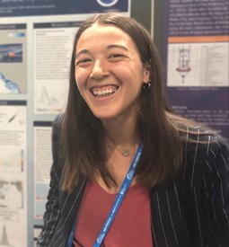

  

    

We are pleased to welcome Dr. Alli Ho to the Seo Lab at UH as a postdoctoral researcher. Dr. Ho joins us from Jet Propulsion Laboratory, where she worked on the Surface Water and Ocean Topography (SWOT) mission to advance high-resolution observations of ocean waves and air–sea interactions. She earned her Ph.D. from Scripps Institution of Oceanography, with a focus on wind–wave and wave–current coupling across coastal and open-ocean environments. At UH, she will work on the ONR-funded SAFARI project, targeting the role of wave–wind–current interactions in modulating air–sea fluxes under atmospheric rivers. Her observational and theoretical expertise strengthens our Lab's onging efforts to understand sea-state-dependent air-sea coupling in extreme conditions.

  

  

    
  

<!--more-->
