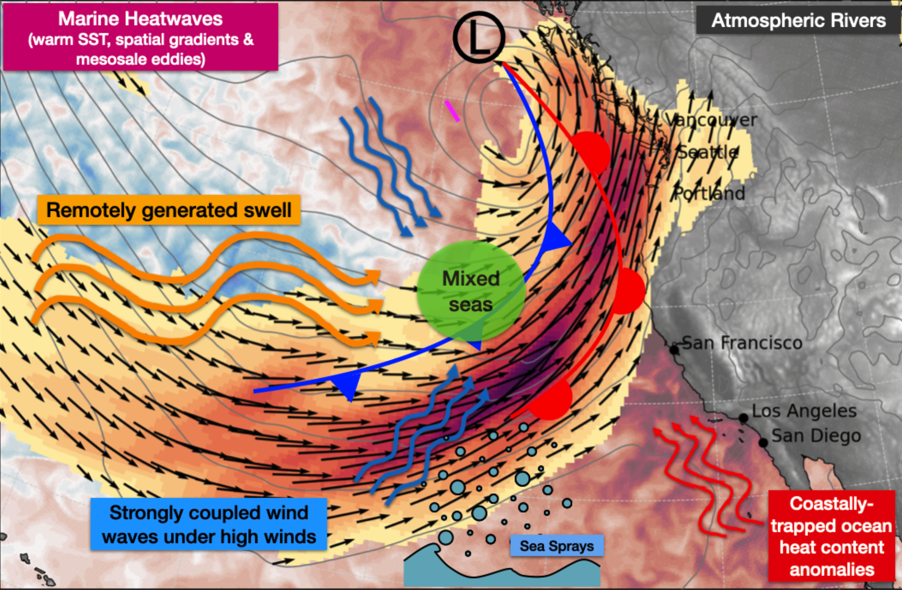

ONR [Study of Air-Sea Fluxes and Atmospheric River Intensity (SAFARI)](https://www.onr.navy.mil/organization/departments/code-32/division-322/marine-meteorology-space/sea-air-flux), PI: Seo

---
The SAFARI DRI aims to improve the physical and predictive understanding of the role of air-sea fluxes and their interactions with turbulent boundary layer processes to accurately simulate and predict atmospheric river (AR) intensity and downstream impacts. Since the air-sea turbulent momentum and heat exchange processes are entirely parameterized in numerical models, an accurate representation of these coupled interactions and their diabatic effects in the lower troposphere is critical for improved predictive capabilities of ARs in operational models. Our project will validate and refine the parameterizations for air-sea fluxes mediated by surface waves and anomalous ocean conditions throughout the ARs' lifecycle and improve the understanding and representation of the interaction with turbulent boundary layer processes in simulation and prediction models. 
<!--more-->
---
A critical element of the project is to refine the widely used advanced bulk flux algorithms, such as COARE, to better represent the effects of enhanced spatial variability in the upper oceans and complex, non-equilibrium sea states, exploiting existing and future measurements from the AR Recon missions and DRI field experiments. The improved air-sea interaction physics will then be implemented and tested in a high-resolution SCOAR regional coupled modeling system to examine the baroclinic response of the atmosphere to diabatic heating and determine the AR simulation sensitivity, including their downstream precipitation over the land. In particular, the project will examine the diabatic modification of ARs' potential vorticity and eddy potential and kinetic energy budgets during anomalous ocean conditions likely to be observed during the field experiments over the North Pacific, including marine heatwaves and coastally trapped heat content anomalies due to El Niño. Any new knowledge from the project will be transferred to different algorithms and numerical models used by other DRI teams. 

The project will also inform the SAFRI field experiments on what enhancements might be needed in sampling plans to resolve wind, wave, and upper ocean conditions critical for improved characterization and parameterization of the coupled boundary layer processes. Our project will inform needed spatial scales of air-sea flux measurements within AR Recon missions and DRI field experiments to enhance the air-sea interaction observing capability. By the end of this project, we will have advanced the process-level understanding of the underlying physics of coupled ocean-atmosphere-wave interactions and have more accurately represented their effects in the simulation and operational models. 

The project will hinge on close collaborations with the DRI teams of in situ measurements, satellite remote sensing, process-oriented modeling, and operational models to guide the field observations, advance the parameterizations, and quantify the impacts in operational systems. By testing the improved physics in the numerical models, the proposed tasks will benefit simulation and forecast models used by the Navy, the DRI modeling teams, and the broad modeling community.

