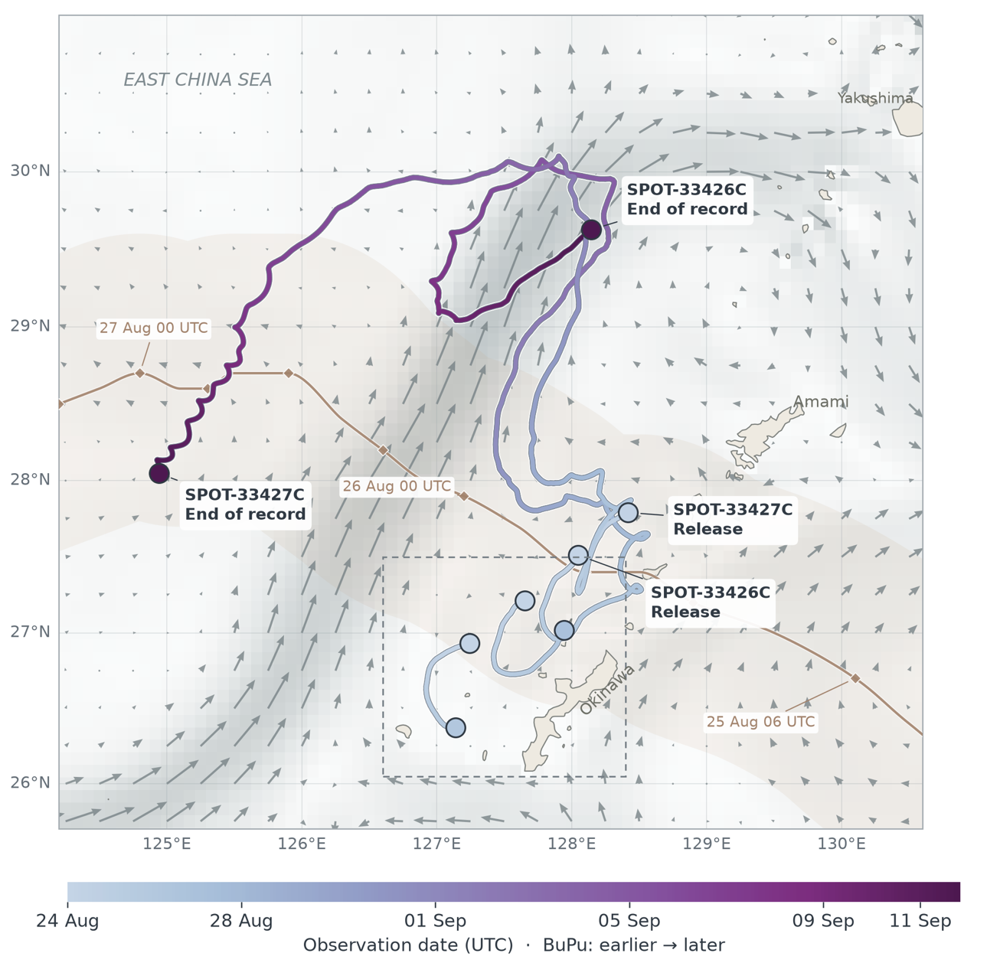
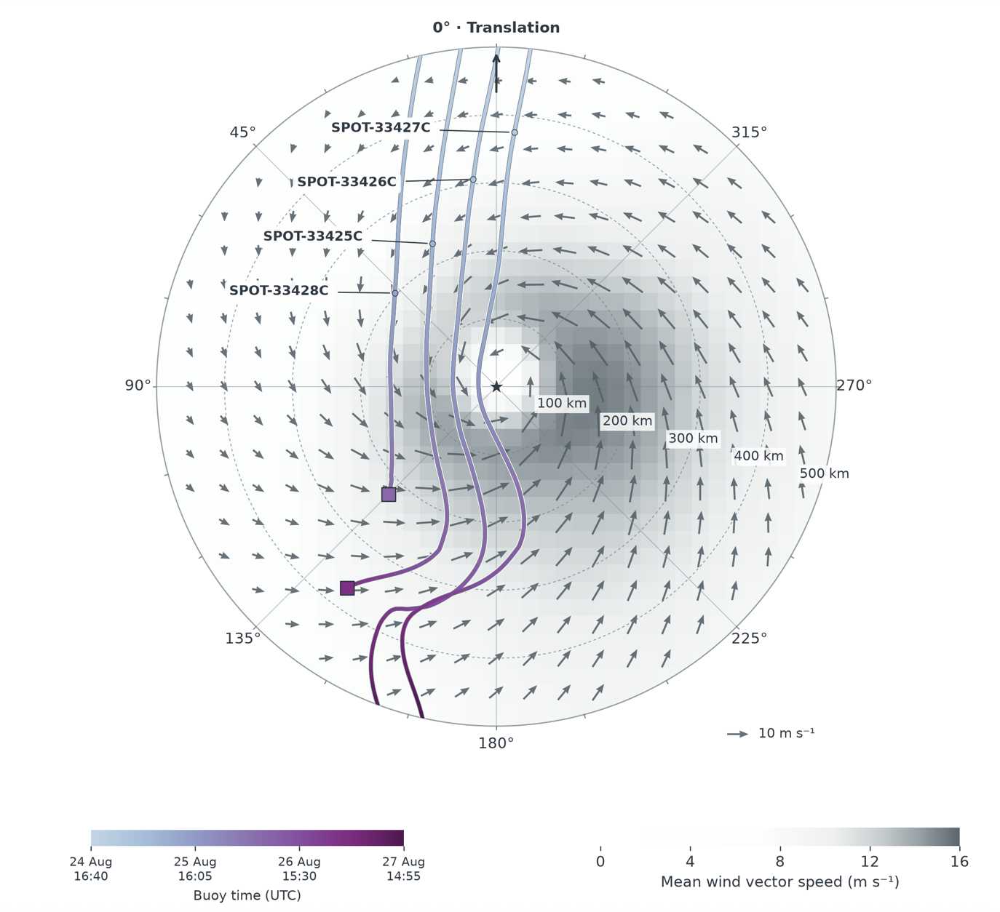
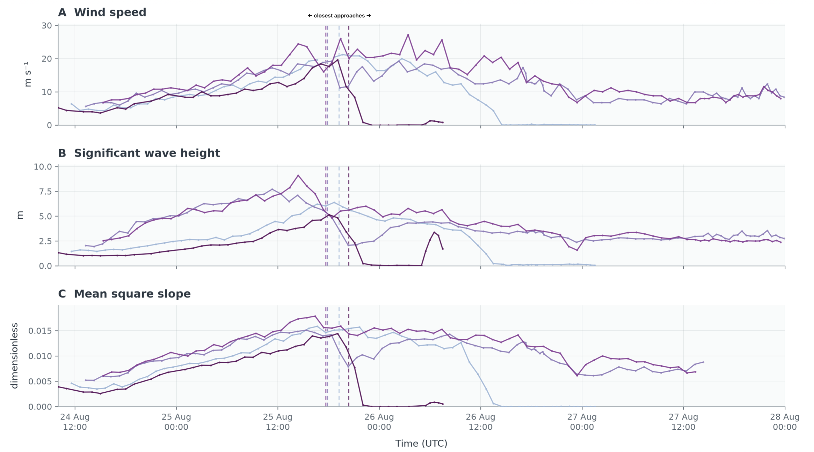
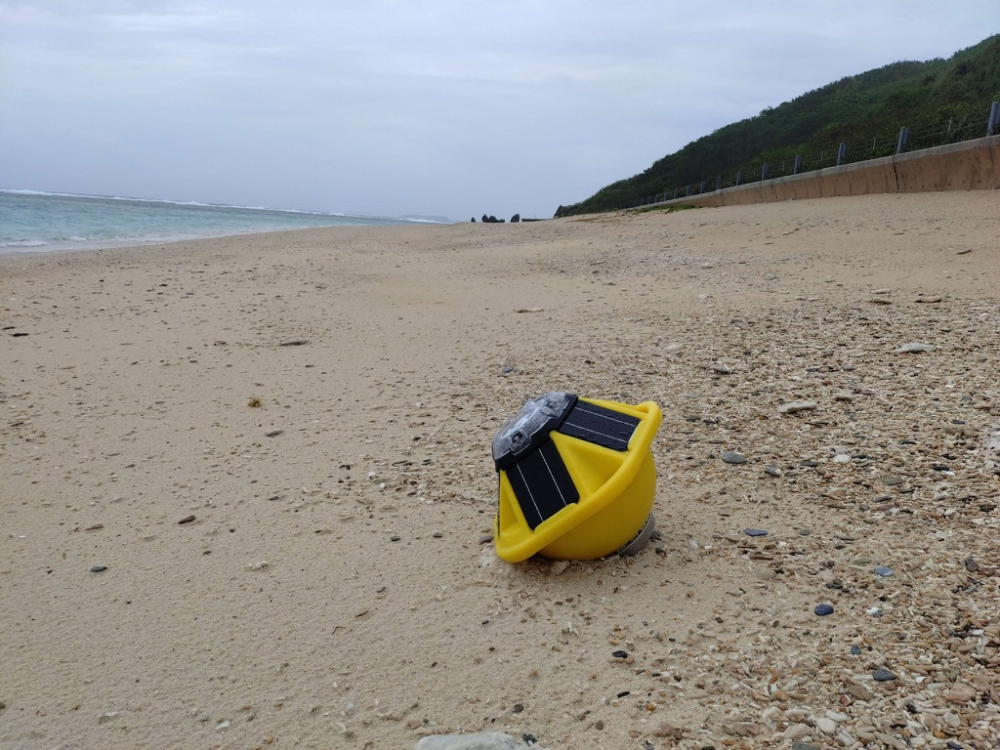

**Joint Research Bettween the Uehiro Center for the Advancement of Oceanography (UC•AO) and the Okinawa Institute of Science and Technology (OIST)** PI: Hyodae Seo

<section class="project-personnel" aria-labelledby="project-personnel-heading">
  <h2 id="project-personnel-heading"></h2>
  

    <figure class="personnel-card agency-card">
      
      <figcaption><a href="https://www.soest.hawaii.edu/oceanography/uc-ao/"><strong>UC•AO</strong></a></figcaption>
    </figure>
    <figure class="personnel-card">
      
      <figcaption><a href="/authors/seo/"><strong>Hyodae Seo</strong></a></figcaption>
    </figure>
    <figure class="personnel-card">
      
      <figcaption><a href="/author/wyn-pauly/"><strong>Wyn Pauly</strong></a></figcaption>
    </figure>
    <figure class="personnel-card">
      
      <figcaption><a href="/authors/sauvage/"><strong>César Sauvage</strong></a></figcaption>
    </figure>
  

</section>

Typhoons, or tropical cyclones, generate rapidly evolving winds, waves, currents, and upper-ocean cooling across deep waters, within island wakes, and over shallow coastal zones. This joint UC•AO–OIST project combines field observations with high-resolution coupled modeling to understand these interactions and improve their representation in coastal typhoon forecast models. Around Okinawa and the Ryukyu Islands, typhoon-driven air–sea exchange is shaped by steep bathymetry, narrow passages between islands, energetic regional currents, and spatially variable wave fields. These processes regulate surface drag and momentum transfer, influence storm-induced mixing and sea-surface temperature cooling, and determine how drifting instruments and other floating objects move through the region.

The project integrates drifting and moored observations of surface waves and currents with a nested implementation of the SCOAR coupled ocean–atmosphere–wave model. The modeling system resolves both the broader typhoon environment and the regional and coastal responses around Okinawa. The observational system measures wave height, period, direction, and directional spectra, as well as sea-surface temperature, winds, currents, and drift trajectories.
<!--more-->

These data allow us to:

- quantify how wind, waves, currents, and bathymetry shape air-sea momentum exchange during typhoons;
- evaluate storm-driven mixing and the development of upper-ocean cold wakes;
- characterize strongly varying sea states across different storm-relative sectors;
- use observed drift and wave spectra to evaluate and improve coupled-model physics and surface-drag parameterizations; and
- build an observational and modeling framework for improved prediction of typhoon impacts near Okinawa.

### Collaboration
  

    

This field effort is a close collaboration between Prof. Hyodae Seo’s <a href="https://www.hyodaeseo.com">SCOAR Lab at the University of Hawaiʻi</a> and Prof. Satoshi Mitarai’s <a href="https://www.oist.jp/research/research-units/mbu">Marine Biophysics Unit at OIST</a>. We gratefully acknowledge our OIST colleagues and the Japan Coast Guard for providing the logistical support essential to the deployment and recovery of the Spotter buoys.
    

  

### Ongoing Work

<section class="project-result">
  <h3>1. Coupled modeling of Typhoon Khanun (2023)</h3>
  

  High-resolution SCOAR coupled ocean-atmosphere-wave simulations are used to examine the evolving ocean and surface wave response to Typhoon Khanun as it passed through the Okinawa region in August 2023. The animation shows the development and persistence of a pronounced cold wake, produced as strong winds and waves increase the turbulence kinetic energy and deepen the ocean mixed layer, bringing cooler subsurface water toward the surface. The calculation provides a spatially continuous view of coupled ocean-atmosphere-wave processes that can be compared with satellite and in situ observations and used to diagnose how currents, bathymetry, and wave-dependent air-sea exchange modulate cooling near the islands.
  

  <figure class="result-figure">
    <video autoplay loop muted playsinline controls preload="metadata" aria-label="Animation of modeled sea-surface temperature and the cold wake generated by Typhoon Khanun near Okinawa in 2023">
      <source src="/projects/UCAO_Typhoon/khanun_sst.webm" type="video/webm">
      Your browser does not support WebM video. <a href="/projects/UCAO_Typhoon/khanun_sst.webm">Open the Khanun animation</a>.
    </video>
	<figcaption>Evolution of sea surface temperature during Typhoon Khanun (2023), illustrating a storm-induced cold wake, most pronounced west of Naha, where the cooling exceeded 9°C compared to the prestorm condition.</figcaption>
  </figure>
</section>

<section class="project-result">
  <h3>2. Deployment of Spotter drifting wave buoys during Typhoon Saudel (2026)</h3>
  

  Four drifting Spotter buoys sampled Typhoon Saudel across distinct storm-relative environments, including the storm center and left-of-track sectors. Their trajectories show how the instruments were advected through rapidly changing wind and current fields while recording strongly variable sea states. The observations include full directional wave spectra, allowing the evolving combination of locally forced wind seas, remotely generated swell, and mixed-sea conditions to be separated rather than summarized by significant wave height alone.
  

  

  These preliminary records demonstrate that a compact multi-buoy array can resolve large spatial differences in the wave field within a single typhoon. The measurements will be used to examine storm-relative wave asymmetry, wave-current interaction, buoy drift, and the performance of coupled simulations and wave-dependent surface-drag formulations.
  

  

  The combined time series compare ERA5 wind speeds with significant wave height and mean square slope estimated independently from all four Spotter buoys. As the buoys approached the storm center, significant wave height increased sharply and reached approximately 9 m at one Spotter. Differences among the four records highlight strong storm-scale spatial variability in both wave energy and short-wave surface roughness.
  

  

    <figure class="result-figure">
      
      <figcaption>Trajectories and observation periods of the four Spotter buoys deployed west of the Okinawa main island, shown with the evolving typhoon track and wind field.</figcaption>
    </figure>
    <figure class="result-figure">
      
      <figcaption>Storm-relative view of the four Spotter trajectories. The buoys sampled the center and left side of the translating storm under substantially different wind and sea-state conditions.</figcaption>
    </figure>
  

  <figure class="result-figure">
    
    <figcaption>Time series from the four Spotter buoys during Typhoon Saudel. ERA5 wind speed is shown in the upper panel; Spotter-derived significant wave height and mean square slope are shown in the middle and lower panels. Dashed lines mark each buoy's closest approach to the storm center. Significant wave height reached approximately 9 m near the center of the storm.</figcaption>
  </figure>
  <figure class="result-figure field-photo">
    
	<figcaption>One of the drifting Spotter buoys beached on Tonaki Island approximately 20 m from the waterline following the Typhoon Saudel deployment. Its transmitted trajectory and wave records captured conditions primarily on the left side of the storm before the buoy reached shore.
	</figcaption>

</section>
