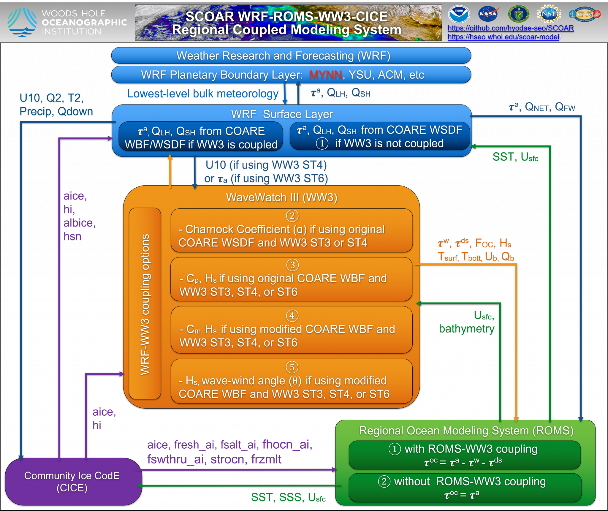
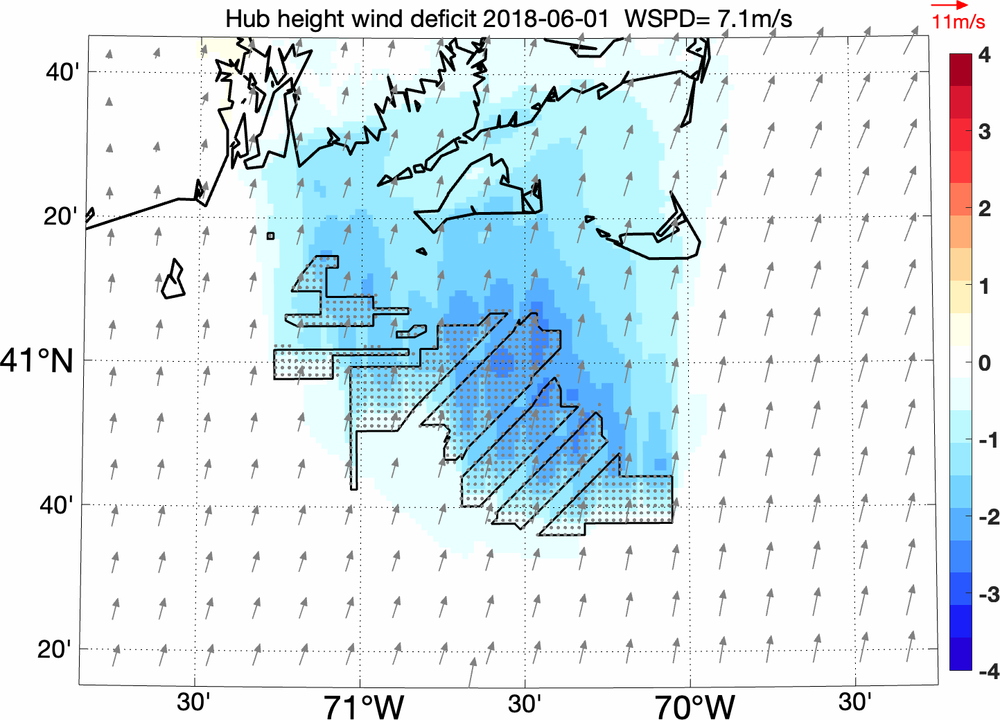

<style>
.article-container { max-width: 1100px; }
.article-title { font-size: 1.6rem; line-height: 1.25; }
.article-style { font-size: 0.82rem; line-height: 1.5; }
.scoar-lead { font-size: inherit; line-height: 1.6; max-width: 900px; }
.scoar-actions { display: flex; flex-wrap: wrap; gap: .7rem; margin: 1.25rem 0 1.75rem; }
.scoar-actions a { background: #1769aa; border-radius: .35rem; color: #fff !important; font-weight: 600; padding: .62rem .95rem; text-decoration: none; }
.scoar-actions a:hover { background: #0d4f86; }
.scoar-architecture img { display: block; height: auto; margin: 1.3rem auto; width: min(100%, 850px); }
.scoar-note { background: #f3f7fa; border-left: 4px solid #1769aa; margin: 1rem 0; padding: .85rem 1rem; }
.article-style table { display: table; font-size: inherit; width: 100%; }
.article-style th { background: #edf4f8; }
.scoar-gallery img { border: 1px solid #d8dfe5; border-radius: .3rem; height: 230px; object-fit: contain; width: 100%; }
.scoar-gallery td { vertical-align: top; width: 33.333%; }
@media (max-width: 760px) {
  .scoar-actions { display: grid; }
  .scoar-actions a { text-align: center; }
  .article-style table { display: block; overflow-x: auto; }
  .scoar-gallery, .scoar-gallery tbody, .scoar-gallery tr, .scoar-gallery td { display: block; width: 100%; }
  .scoar-gallery img { height: auto; max-height: 320px; }
}
</style>

<p class="scoar-lead">
The <strong>Scripps Coupled Ocean–Atmosphere Regional (SCOAR)</strong> modeling system is a regional framework that connects the atmosphere, ocean, and surface waves. It couples WRF, ROMS, and WAVEWATCH III (WW3), with air–sea exchange calculated using COARE-based bulk-flux formulations, to investigate feedbacks that uncoupled component models cannot represent.
</p>

<div class="scoar-actions">
  <a href="https://github.com/uh-manoa-scoar/scoar">View source on GitHub</a>
  <a href="https://github.com/uh-manoa-scoar/scoar/tree/main/Tutorial_Doc">Read the tutorial material</a>
  <a href="/pubs/">Browse SCOAR publications</a>
</div>

### SCOAR

SCOAR supports interactive exchanges among the components, allowing the simulated ocean and sea state to influence the atmosphere while atmospheric forcing modifies currents, temperature, and waves. This framework is designed for questions involving:

- Ocean feedbacks to weather and regional climate through evolving SST and surface currents.
- Sea-state effects on momentum, sensible-heat, and latent-heat exchange.
- Wave–wind misalignment and nonequilibrium seas, including tropical-cyclone conditions.
- Conventional and experimental sea-state-dependent COARE bulk-flux parameterizations for momentum and heat exchange, including formulations for nonequilibrium seas and sea-spray effects.
- Mesoscale and frontal air–sea interaction, with online spatial filtering options for separating scales.
- Flexible atmosphere–ocean, atmosphere–wave, and ocean–wave coupling strategies.

### Brief history

SCOAR was developed at Scripps Institution of Oceanography, initially coupling the Regional Spectral Model (RSM) with ROMS ([Seo et al. 2007b](/pubs/papers/scoar_jcli.07.pdf)).
At Woods Hole Oceanographic Institution, the system was extended to WRF–ROMS coupling ([Seo and Yang, 2013)](/pubs/papers/seo.yang_.13.jgra_.pdf), including applications to the Arctic atmospheric boundary layer. 
[Putrasahan et al. (2013)](/pubs/papers/putrasahan.etal_.13.dao_.kuroshio.pdf) introduced scale-selective interactive SST coupling, and [Seo et al. (2014)](/pubs/papers/seo.etal_.16.ccs_.eddy_.pdf) later extended the feedbacks to include surface currents. [Sauvage et al. (2023)](/pubs/papers/sauvage.etal_.23.jgro_.wave_flux.pdf) incorporated WW3 coupling. 
SCOAR is now maintained and extended by the [Seo Lab](https://www.hyodaeseo.com) at the University of Hawaiʻi at Mānoa. 
See [Publications](/pubs/) for the cited studies and [Presentations](/present/) for oral and poster presentations.


### Coupling architecture

| Component | Primary role | Representative fields exchanged |
|---|---|---|
| [WRF](https://github.com/wrf-model/WRF) | Regional atmosphere | Near-surface winds, air temperature, humidity, pressure, precipitation, and radiative forcing |
| [ROMS](https://github.com/kshedstrom/roms) | Regional ocean | Sea-surface temperature, surface currents, sea level, salinity, and bathymetric information |
| [WW3](https://github.com/NOAA-EMC/WW3) | Surface waves | Wave spectra, significant wave height, wave direction, wave-supported stress, and wave age |
| [SCOAR coupler](https://github.com/uh-manoa-scoar/scoar) | Coordinates model exchange | Coupling cadence, interpolation, input/output exchange, scale filtering, and coupling options |

<div class="scoar-architecture">



</div>

### Software requirements

SCOAR is the coupling layer; the component models must be downloaded, configured, compiled, and tested separately.

| Requirement | Notes |
|---|---|
| WRF | Install from the official WRF repository; SCOAR exchanges fields with WRF and its surface-layer implementation |
| ROMS | Install a compatible ROMS distribution and verify the regional ocean configuration independently |
| WW3 | Required for explicit wave coupling and wave-aware surface-flux options |
| COARE | The current documented configuration uses COARE 3.5 formulations implemented in the WRF surface layer |
| Build environment | A Fortran toolchain plus the MPI and NetCDF libraries required by the selected component-model builds |
| Workflow tools | Shell utilities are used by the coupler; MATLAB-based ROMS/WW3 preprocessing tools are included in the repository |
| Input data | Atmospheric, oceanic, and wave initial and boundary conditions appropriate to the selected domain |

<div class="scoar-note">
<strong>Compatibility note:</strong> exact model versions, compiler choices, coupling options, and namelist settings are experiment-specific. Confirm them against the selected SCOAR branch and its configuration files before beginning a production simulation.
</div>

### Quick start

1. **Clone SCOAR.**

   ```bash
   git clone https://github.com/uh-manoa-scoar/scoar.git
   cd scoar
   ```

2. **Install and test the component models.** Build WRF, ROMS, and—when wave coupling is required—WW3 independently before connecting them through SCOAR.

3. **Review the repository layout.** The main coupling workflow is organized across [`Shell`](https://github.com/uh-manoa-scoar/scoar/tree/main/Shell), [`Lib`](https://github.com/uh-manoa-scoar/scoar/tree/main/Lib), and the [`main_scripts`](https://github.com/uh-manoa-scoar/scoar/tree/main/main_scripts) directory.

4. **Select and prepare a domain.** Start with the version-controlled material in [`Data/domains`](https://github.com/uh-manoa-scoar/scoar/tree/main/Data/domains), then prepare atmosphere, ocean, and wave grids and forcing for the intended experiment.

5. **Configure model paths and coupling choices.** Set the component executable locations, coupling interval, exchanged variables, surface-flux option, and any online smoothing or eddy-filtering choices.

6. **Run a short validation case.** Confirm that each component advances, coupling files are exchanged at the expected times, fields are on the correct grids, and conservation/continuity checks are reasonable before scaling up.

7. **Postprocess and compare.** Use the supplied [`postprocess_scripts`](https://github.com/uh-manoa-scoar/scoar/tree/main/postprocess_scripts) and compare coupled output with an uncoupled control and available observations.

#### Starter example: a regional coupled experiment

This starter workflow provides a reproducible structure for a short atmosphere–ocean–wave sensitivity experiment. The forcing datasets and exact namelists must be selected for the target region, but all experiment-specific inputs should be versioned together.

| Step | Configuration | Verification target |
|---|---|---|
| Domain | Use a shared regional grid definition from `Data/domains`; document map projection, horizontal spacing, vertical levels, and simulation dates | WRF, ROMS, and WW3 domains overlap correctly |
| Control | Run atmosphere–ocean coupling with a documented bulk-flux configuration | Stable exchange of winds, heat fluxes, SST, and currents |
| Wave-coupled case | Enable WW3 and the selected wave-based surface-flux option, keeping other settings unchanged | Wave fields reach WRF/ROMS at every coupling interval |
| Diagnostics | Archive SST, surface currents, 10-m winds, pressure, heat fluxes, stress vectors, significant wave height, and wave direction | No missing exchange times or unexplained discontinuities |
| Evaluation | Compare the control and wave-coupled runs against the same observational products | Quantified effects of coupling on fluxes, sea state, and regional circulation |

For reproducibility, record the SCOAR commit, component-model versions, compiler/MPI/NetCDF environment, forcing-data sources, coupling interval, namelists, and postprocessing commands. Begin with the repository’s [`Tutorial_Doc`](https://github.com/uh-manoa-scoar/scoar/tree/main/Tutorial_Doc) and [`Data/domains`](https://github.com/uh-manoa-scoar/scoar/tree/main/Data/domains) directories.

### Example applications

<table class="scoar-gallery">
<tr>
<td>


**Marine heatwaves and atmospheric rivers.** Coupled ocean–atmosphere processes can shape compound extremes when marine heatwaves interact with landfalling atmospheric rivers. See [Renkl et al. (2026)](/pubs/papers/renkl.etal.26.scirepo.pdf) and the [SAFARI project](/projects/onr_safari/).

</td>
<td>


**Sea state and surface drag under tropical cyclones.** SCOAR supports studies of evolving sea states, wave–wind misalignment, upper-ocean cooling, and drag-coefficient behavior under extreme winds. This example shows the sea-surface temperature response beneath Typhoon Khanun (2023). [Related project →](/projects/onr_astral/)

</td>
<td>



**Offshore wind farms and air–sea interaction.** Coupled simulations show how large offshore wind farms can modify atmospheric wakes, surface waves, upper-ocean mixing, and ocean-to-atmosphere feedbacks. See [Seo et al. (2025)](/pubs/papers/seo_etal_2025_WindFarm.pdf) and [Sauvage et al. (2025)](/pubs/papers/sauvage.etal.25.pdf).

</td>
</tr>
</table>

The SCOAR framework has been applied across tropical-cyclone, atmospheric-river, coastal, offshore-wind, and tropical-Pacific research. See the [publication](/pubs/) and [current projects](/projects/) for peer-reviewed results and ongoing applications.
